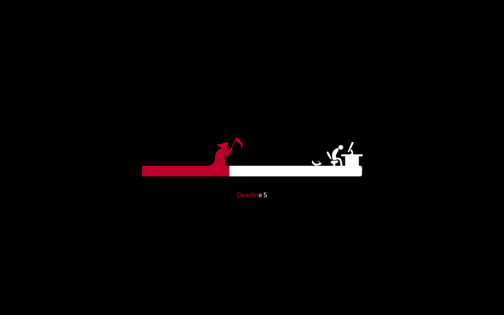

# 💀 Deadline Loader


> *"Death is coming… for your deadline."*

**🔴 Live demo:** https://erionnezha.github.io/Deadline-Loader/

A cinematic **SVG + CSS3 loading animation**: the Grim Reaper chases a desperate designer along a burning progress bar while the day counter ticks down to zero. Dark, dramatic, and weirdly motivating — the perfect loader for anyone who has ever raced a deadline.





## ✨ Features


- 🔥 **Pure SVG + CSS3 animation** — hand-crafted vector scenes, no video files
- 💀 Animated Grim Reaper with scythe, flickering flames and a burning progress trail
- ⏳ Live **day countdown** synced to the animation timeline
- ⚡ Lightweight — a single HTML page with zero build step
- 🎨 Easily themeable — one CSS file controls every color and timing


## 🎬 Preview


Open `index.html` in any modern browser — the ~20 second sequence plays automatically:


1. The Reaper rises and begins the chase 🏃‍♂️💨
2. The progress bar ignites behind the runner 🔥
3. The day counter drops: 7 → 6 → 5 … ⏳
4. Deadline hits zero. No survivors. 😱


## 🚀 Usage


No build tools, no server required:


```bash
# just open it
open index.html
```


Or drop the files into any static host (Netlify, Vercel, GitHub Pages).


## 🛠️ Customization


All behavior lives in two small files:


| File | What to tweak |
|------|---------------|
| `script.js` | `animationTime` (seconds) and `days` (countdown length) |
| `style.css` | Colors, speeds, flame and reaper styling |


```js
var animationTime = 20,  // total animation length in seconds
    days = 7;            // days shown on the countdown
```


## 📁 Structure


```
Deadline-Loader/
├── index.html            # the animated scene (SVG)
├── style.css             # all animation keyframes & styling
├── script.js             # countdown timer logic (jQuery)
├── jquery-2.2.4.min.js   # dependency
├── demo.png              # preview screenshot
└── README.md
```


## 📄 License


Copyright © 2026 Erion Nezha. All rights reserved.
